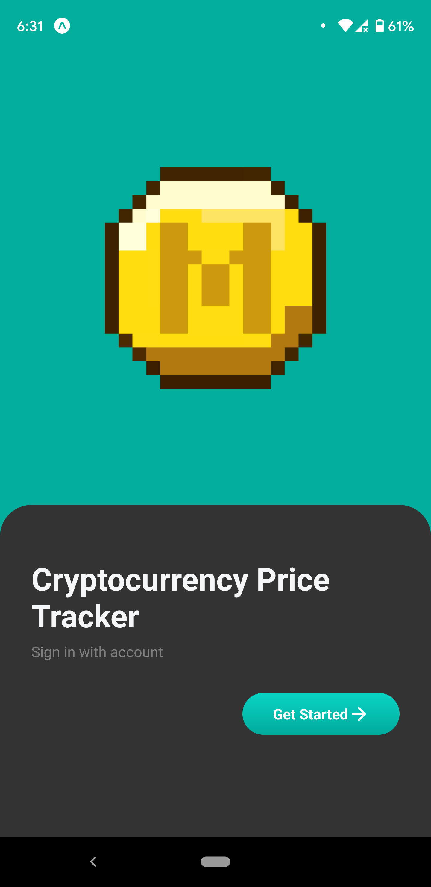

# Bitcoin-React-NodeJS-App

# Crypto-Tracker-App

<p align="center">
  
</p>

<div align="center">


[](https://github.com/prettier/prettier)
[](http://makeapullrequest.com)

</div>

# Crypto Tracker App

A Crypto Tracker App inspired by SpiralDev's [**CryptoTracker**](https://github.com/SpiralDevelopment/CryptoTracker), built using React Native, utilizing [CoinGecko API](https://www.coingecko.com/api/documentations/v3) to track the price of cryptocurrencies.


## User Stories

- [ ] The user can request the list of cryptocurrencies from the CoinGecko API and see the results collated together.
- [ ] Progressively load more list items by scrolling down the list.
- [ ] The user can sort the cryptocurrencies based on their `Market Cap` and `Volume`.
- [ ] The application supports theming and can easily be switched between themes.

## App Details

### Screenshots

| Prices by Market Cap  | Detail Screen | Sorted By |
| :-: | :-: | :-: |
|  |  |  |

### User Registration

| Splash Screen  | Sign In | Sign Up |
| :-: | :-: | :-: |
|  |   |   |


### Dark Theme

| Splash Screen  | Sign In | Detail Screen |
| :-: | :-: | :-: |
|  |   |   |

### Loading Environment Variables

In the root directory/top-level of your app, create a `.env` file.

```
COINGECKO_URL=https://api.coingecko.com
```

## Useful links and resources
- [An efficient way to structure React Native projects](https://cheesecakelabs.com/blog/efficient-way-structure-react-native-projects/)
- [React Native Scroll Item animation effect - FlatList and Animated API](https://www.youtube.com/watch?v=F8x-dyIsrJ8)
- [How to Properly Use Environment Variables in an Expo React Native App](https://medium.com/swlh/how-to-properly-use-environment-variables-in-an-expo-react-native-app-7ab852590b30#:~:text=An%20environment%20variable%20is%20a,to%20be%20imported%20at%20all.)
- [The top 8 React Native chart libraries for 2021](https://blog.logrocket.com/the-top-8-react-native-chart-libraries-for-2021/)
- [6 Tips to Make Better Dark Theme](https://uxmisfit.com/2020/09/14/ui-tutorial-6-tips-to-make-better-dark-theme/)


# Crypto-Wallet-App

> A Crypto Wallet application developed with React Native.

## Features
- Learning the current crypto prices
- Creating an alarm
- Wallet Information
- Trading history
- Sell or buy crypto


## Libraries used

- React Navigation
- Reanimated
- Linear Gradient
- Splash-screen
- Svg
- Vector-icons
- Victory-Native

## Screenshots


Splash Screen | Home 
:-------------------------: | :-------------------------: 
 | 

Crypto Detail  | Transaction
:-------------------------: | :-------------------------:
 | 


# Building


##### 1. Clone the Repo Locally
```Bash
git clone https://github.com/sreytouch/Bitcoin-React-NodeJS-App
```

##### 2. Install the dependency
```Bash
yarn add || npm install
```

##### 3. Install the Pods
```Bash
cd ios && pod install && cd ..
```
(If you do not have CocoaPods installed on your machine, [check this out](https://cocoapods.org/#install).)

##### 4. run project
```Bash
yarn ios/android 
```
